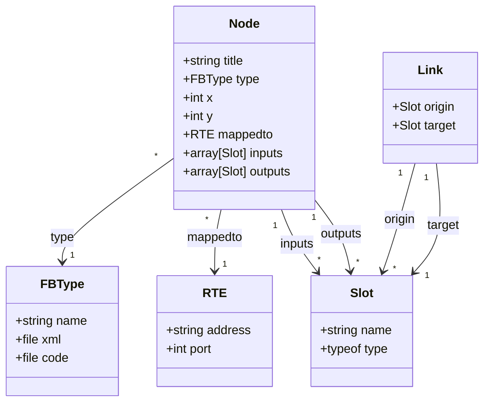
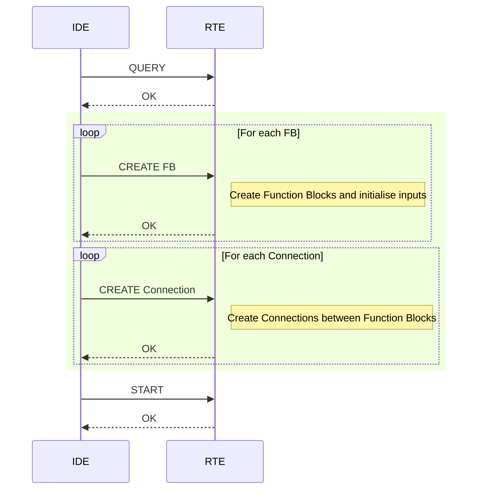
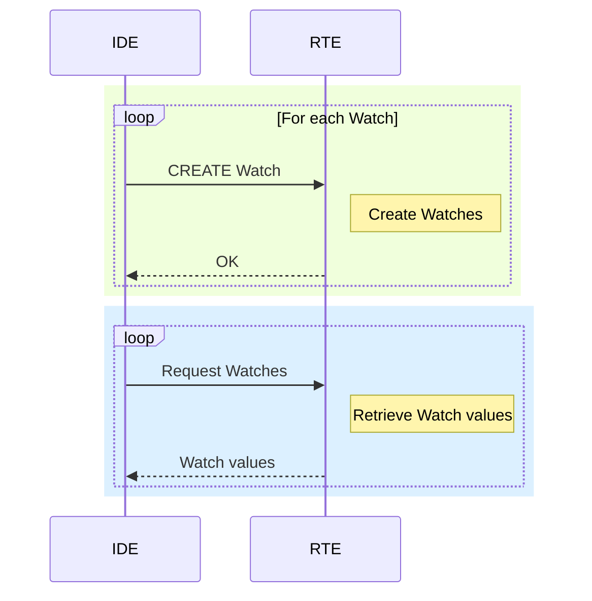

```mermaid
classDiagram
    FBType : +string name
    FBType : +file xml
    FBType : +file code

    Node : +string title
    Node : +FBType type
    Node : +int x
    Node : +int y
    Node : +RTE mappedto
    Node : +array[Slot] inputs
    Node : +array[Slot] outputs

    Link : +Slot origin
    Link : +Slot target

    Slot : +string name
    Slot : +typeof type

    RTE : +string address
    RTE : +int port

    Node "*" --> "1" FBType : type
    Node "*" --> "1" RTE : mappedto
    Node "1" --> "*" Slot : inputs
    Node "1" --> "*" Slot : outputs
    
    Link "1" --> "*" Slot : origin
    Link "1" --> "1" Slot : target
```

```mermaid
sequenceDiagram
    IDE->>RTE: QUERY
    RTE-->>IDE: OK

    rect rgb(240,255,220)
        loop For each FB
            IDE->>RTE: CREATE FB
            Note right of RTE: Create Function Blocks and initialise inputs
            RTE-->>IDE: OK
        end


        loop For each Connection
            IDE->>RTE: CREATE Connection
            Note right of RTE: Create Connections between Function Blocks
            RTE-->>IDE: OK
        end
    end

    IDE->>RTE: START
    RTE-->>IDE: OK
```

```mermaid
sequenceDiagram
    rect rgb(240,255,220)
        loop For each Watch
            IDE->>RTE: CREATE Watch
            Note right of RTE: Create Watches
            RTE-->>IDE: OK
        end
    end

    rect rgb(220, 240, 255)
        loop
            IDE->>RTE: Request Watches
            Note right of RTE: Retrieve Watch values
            RTE-->>IDE: Watch values
        end
    end
```
