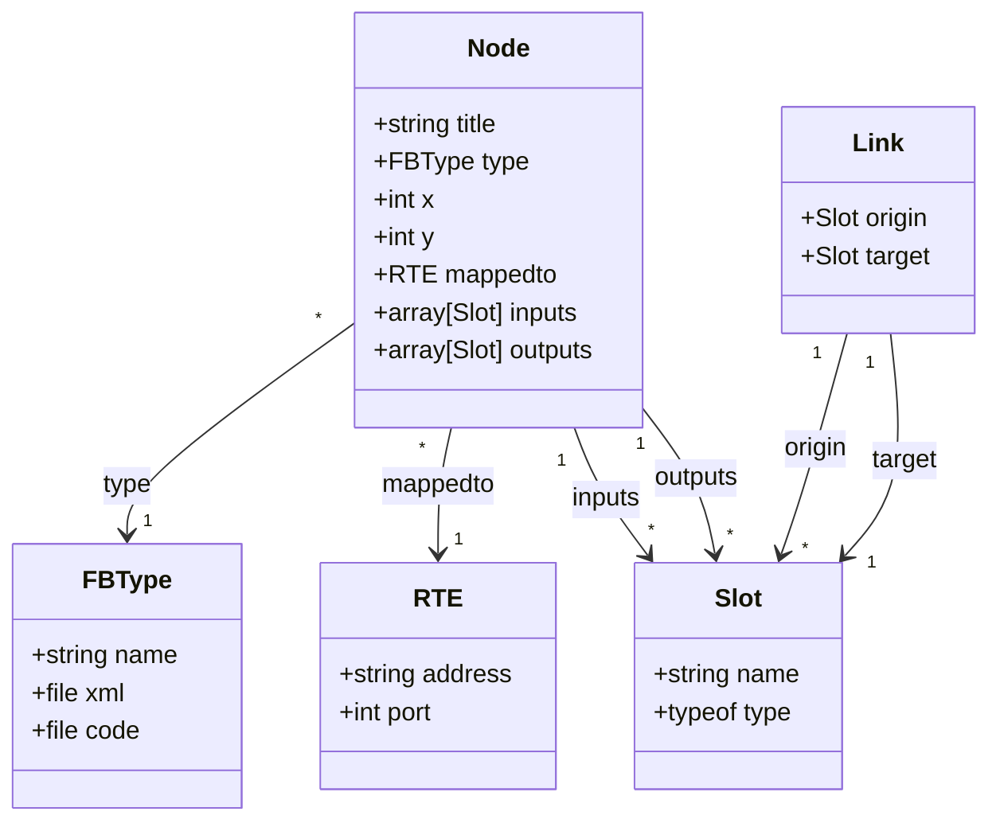

```mermaid
classDiagram
    FBType : +string name
    FBType : +file xml
    FBType : +file code

    Node : +string title
    Node : +FBType type
    Node : +int x
    Node : +int y
    Node : +RTE mappedto
    Node : +array[Slot] inputs
    Node : +array[Slot] outputs

    Link : +Slot origin
    Link : +Slot target

    Slot : +string name
    Slot : +typeof type

    RTE : +string address
    RTE : +int port

    Node "*" --> "1" FBType : type
    Node "*" --> "1" RTE : mappedto
    Node "1" --> "*" Slot : inputs
    Node "1" --> "*" Slot : outputs
    
    Link "1" --> "*" Slot : origin
    Link "1" --> "1" Slot : target
```
